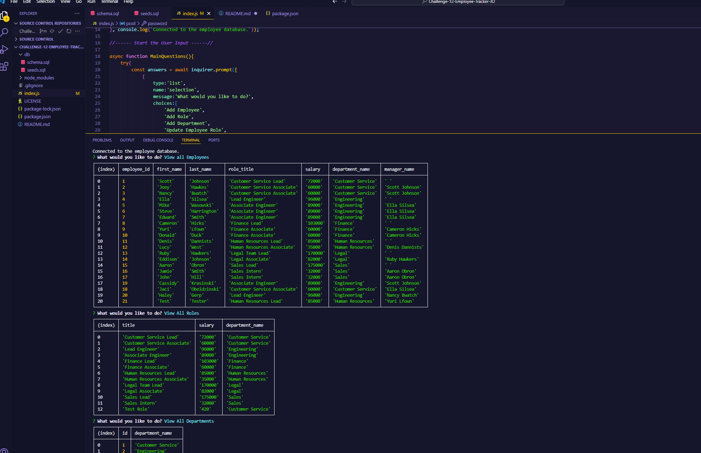

# Challenge-12-Employee-Tracker-JO
## Description
This is Jaci Obeidzinski's Challenge for Module 12. This is a postgresSQL content management system that allows people to run this code in a termainal and have simple questions come up what will allow them to view or add employees, roles or departments in the database that would be connected.  

## How to Install
First you will need install the code onto your personal computer. Then you will need to create a postgreSQL database with the name employeeTracker_db using the schema.sql and seed it with relevent infromation to you(please see seeds.sql for idea on how to do this). Then you can open the terminal and run the program using node index.js. 

## License
MIT license

## Special Thanks
Thank you to everyone in my class for participating in class allowing me to learn more. 
Thank you to my instructor Chris and the Teaching Assistant Steven. 
## Screen Shot

## Questions 
If you have any questions contact me at my GitHub @JaciObeid
or email me at jobeidzinski2@gmail.com